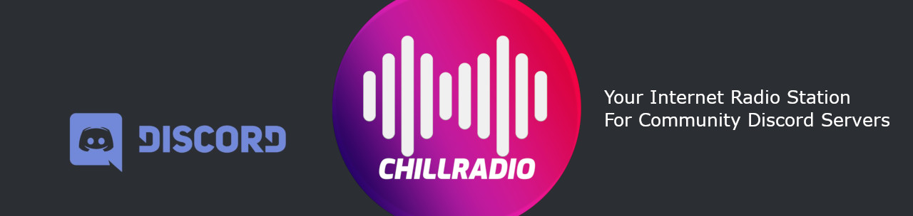

# ChillRadio Discord Bot [](https://facebook.com/warengonzagaofficial)

[](https://chillradio.live/discordbot) [](https://github.com/WarenGonzaga/chillradio-discord-bot) [](https://github.com/WarenGonzaga/chillradio-discord-bot) [](https://github.com/WarenGonzaga/chillradio-discord-bot) [](https://nodejs.org)



[ChillRadio](https://chillradio.live) official internet radio station discord bot for community servers. Philippine based internet radio station. Listen to 24/7 music streaming!

[](https://www.producthunt.com/posts/chillradio-discord-bot?utm_source=badge-featured&utm_medium=badge&utm_souce=badge-chillradio-discord-bot)

## Usage

[Add this bot](https://chillradio.live/discordbot) to your Discord server. Make sure you are connected to any voice channel to start listening to the internet radio. Use the available commands below to control the discord bot.

## Bot Commands

The default bot command is tilde (__``~``__).

| Commands | Alias | Arguments | Description | Example
| --- | ---| --- | --- | --- |
| hi | none | none | Greetings | ~hi |
| hello | none | none | Greetings | ~hello |
| tunein | in | none | Listen to the radio | ~tunein |
| turnoff | off | none | Stop the radio | ~turnoff |
| request | req | song \| artist \| greetings | Request a song to the DJ | ~request fresh adventure \| laboum \| greetings to all |

## Discord Permissions

To be able to work this bot in your Discord server, the bot should have the following permission.

* Read Message
* Send Message
* Manage Message
* View Channel
* Speak
* Connect

For more information please visit Discord [permission reference](https://discordapi.com/permissions.html#3156992).

## Contributing

Contributions are welcome, create a pull request to this repo and I will review your code. Please consider to submit your pull request to the ```dev``` branch. Thank you!

## Issues

If you're facing a problem in using ChillRadio Discord Bot please let me know by creating an issue in this github repository. I'm happy to help you! Don't forget to provide some screenshot or error logs of it!

## To Do

* Add more commands
* Add more features
* Better error handling
* Discord bot website
* Discord server for support
* Code refactoring
* More... (have suggestions? let me know!)

## Community

Looking to get in touch with me? Well, your first step is to join to my community.

[](https://discord.gg/wCSVMU) [](https://discord.io/ppop-official)

Wanna see other projects I made? Join today!

[](https://discord.io/warengonzaga) [](https://discord.io/warengonzaga)

## Donate or Support

If you love this free internet radio for community discord server please consider to donate or **support the developer** to cover **development** and **server expenses**.

[](https://paypal.me/warengonzagaofficial) [](https://buymeacoff.ee/warengonzaga)

## License

ChillRadio Discord Bot is licensed under GNU General Public License v3 - <https://opensource.org/licenses/GPL-3.0>

## Author

ChillRadio Discord Bot is Developed and Maintained by **Waren Gonzaga**

* **Facebook:** <https://facebook.com/warengonzagaofficial>
* **Twitter:** <https://twitter.com/warengonzaga>
* **Website:** <https://warengonzaga.com>
* **Email:** dev(at)warengonzaga[.]com

---

:computer: with :heart: by **Waren Gonzaga** with **YHWH** :pray:
